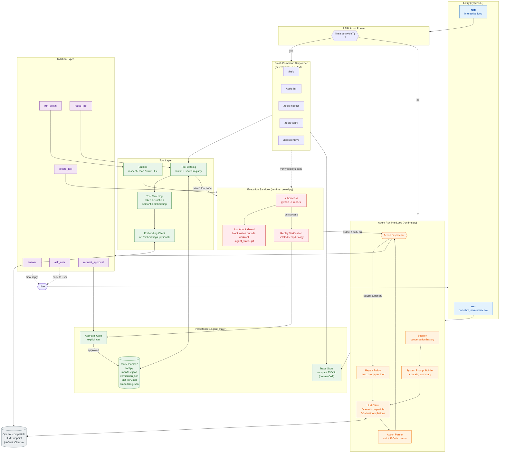
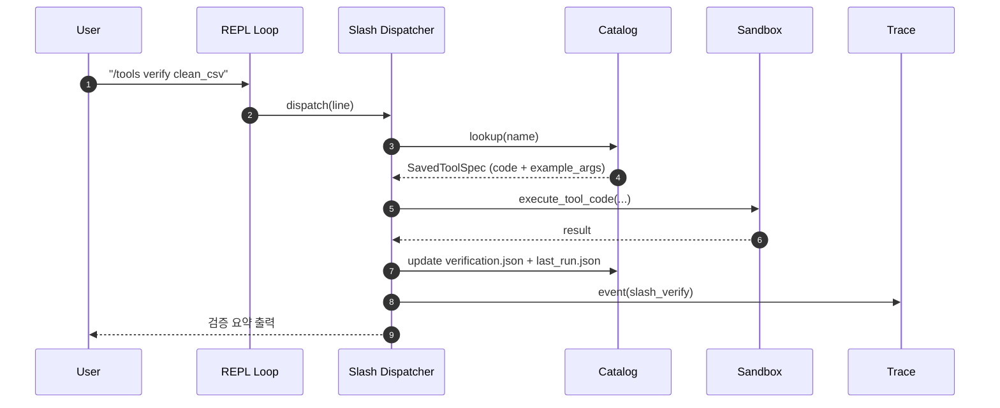

# Adaptive Agent — System Design

코드(`src/adaptive_agent/`)를 그대로 매핑한 현재 시스템의 컴포넌트 구성과 요청 흐름.

## 1. Component Overview



## 2. Request Flow — `create_tool` Happy Path

가장 핵심 경로(generated tool 생성 → 검증 → 승인 → 저장).

```mermaid
sequenceDiagram
    autonumber
    participant U as User
    participant CLI as CLI (Typer)
    participant RT as Runtime Loop
    participant LM as LLM Client
    participant SB as Sandbox<br/>(subprocess + guard)
    participant RP as Replay (tempdir)
    participant AG as Approval Gate
    participant CT as Catalog
    participant TR as Trace

    U->>CLI: 자연어 작업
    CLI->>RT: run_task(task)
    RT->>LM: messages + system prompt + catalog summary
    LM-->>RT: JSON action
    RT->>TR: event(action)

    alt action = create_tool
        RT->>SB: execute(code, argv)
        SB-->>RT: stdout / stderr / exit
        Note over SB: audit hook blocks writes<br/>outside workroot/.agent_state/.git

        alt 실행 성공
            RT->>RP: replay in isolated copy
            RP-->>RT: verification result
            RT->>RT: pending_save 보관<br/>(answer 이후로 deferred)
        else 실패
            RT->>LM: compact failure summary<br/>(repair, max 1회)
            LM-->>RT: 수정된 code
            RT->>SB: execute (repair)
        end
    end

    RT->>LM: 다음 턴 (answer 유도)
    LM-->>RT: action = answer
    RT-->>U: final_answer 출력

    RT->>AG: 저장 여부 [y/n]
    AG-->>U: prompt
    U-->>AG: y
    AG->>CT: save_generated(spec)
    CT-->>CT: tools/&lt;name&gt;/ 패키지 저장<br/>+ embedding 캐시
    CT->>TR: event(saved_tool)
```

## 3. REPL Slash Command Path

LLM을 거치지 않는 결정론 경로.



## 4. Trust & Isolation Boundaries

| 경계 | 신뢰 수준 | 강제 수단 |
|---|---|---|
| User input | untrusted | LLM 입력으로만 사용, action JSON 강제 |
| LLM output | untrusted | `parse_action`이 JSON schema 검증, 알려진 6개 action만 허용 |
| Generated/saved tool code | untrusted | subprocess + Python audit-hook guard, workroot 외 쓰기·`.agent_state`/`.git` 쓰기 차단 |
| Replay 환경 | 분리 | tempdir 복사본에서 실행, 실제 workroot 부수효과 없음 |
| Persistence | gated | explicit `y/n` approval 통과 후에만 `.agent_state/tools/`에 기록 |
| Slash commands | trusted runtime | LLM 우회, deterministic dispatcher만 호출 |

## 5. State Layout

```text
.agent_state/
├── traces/
│   └── <session>.jsonl          # compact event log (no raw CoT)
└── tools/
    └── <name>/
        ├── tool.py              # generated source
        ├── manifest.json        # name/version/desc/example_args/verification_status
        ├── verification.json    # 최근 검증 결과
        ├── last_run.json        # 최근 실행 metric
        └── embedding.json       # semantic matching cache (optional)
```
